# NayaBato - Civic Engagement Platform Use Case Diagram

```mermaid
graph TB
    %% Actors
    Citizen[👤 Citizen]
    Admin[👨‍💼 Admin]
    Official[👨‍🏛️ Official]
    System[🤖 System]
    EmailService[📧 Email Service]
    
    %% Main Use Cases
    subgraph "Issue Management"
        ReportIssue[Report Issue]
        ViewIssues[View Community Issues]
        TrackIssue[Track Issue Status]
        CommentIssue[Comment on Issue]
        UpdateStatus[Update Issue Status]
        AssignIssue[Assign Issue]
        ResolveIssue[Resolve Issue]
        RejectIssue[Reject Issue]
    end
    
    subgraph "User Management"
        Register[Register Account]
        Login[Login/Logout]
        ManageProfile[Manage Profile]
        VerifyAccount[Verify Account]
        ResetPassword[Reset Password]
        ManageUsers[Manage Users]
        AssignRoles[Assign User Roles]
    end
    
    subgraph "Geographic & Ward Management"
        AutoAssignWard[Auto-Assign Ward]
        ManageWards[Manage Wards]
        ViewMap[View Interactive Map]
        LocationTracking[Location-based Services]
        HaversineCalculation[Calculate Distances]
    end
    
    subgraph "Administrative Functions"
        ViewAnalytics[View Analytics]
        GenerateReports[Generate Reports]
        ManageDepartments[Manage Departments]
        AuditLogs[View Audit Logs]
        SystemMetrics[Monitor System Metrics]
        SessionManagement[Manage User Sessions]
    end
    
    subgraph "Communication System"
        SendNotifications[Send Notifications]
        EmailAlerts[Email Alerts]
        WeeklyDigest[Weekly Digest]
        InAppNotifications[In-App Notifications]
        NewsletterSubscription[Newsletter Subscription]
    end
    
    subgraph "Official Dashboard"
        OfficialDashboard[Official Dashboard]
        ManageAssignedIssues[Manage Assigned Issues]
        ViewWardIssues[View Ward Issues]
        UpdateProgress[Update Issue Progress]
        ViewOfficialStats[View Official Statistics]
    end
    
    %% Citizen Use Cases
    Citizen --> Register
    Citizen --> Login
    Citizen --> ReportIssue
    Citizen --> ViewIssues
    Citizen --> TrackIssue
    Citizen --> CommentIssue
    Citizen --> ManageProfile
    Citizen --> ViewMap
    Citizen --> NewsletterSubscription
    
    %% Admin Use Cases
    Admin --> Login
    Admin --> ManageUsers
    Admin --> AssignRoles
    Admin --> ManageWards
    Admin --> ManageDepartments
    Admin --> ViewAnalytics
    Admin --> GenerateReports
    Admin --> AuditLogs
    Admin --> SystemMetrics
    Admin --> SessionManagement
    Admin --> AssignIssue
    Admin --> UpdateStatus
    
    %% Official Use Cases
    Official --> Login
    Official --> OfficialDashboard
    Official --> ManageAssignedIssues
    Official --> ViewWardIssues
    Official --> UpdateStatus
    Official --> UpdateProgress
    Official --> ResolveIssue
    Official --> RejectIssue
    Official --> ViewOfficialStats
    Official --> CommentIssue
    
    %% System Automated Use Cases
    System --> AutoAssignWard
    System --> HaversineCalculation
    System --> SendNotifications
    System --> LocationTracking
    System --> VerifyAccount
    
    %% Email Service Use Cases
    EmailService --> EmailAlerts
    EmailService --> WeeklyDigest
    EmailService --> ResetPassword
    
    %% Relationships and Extensions
    ReportIssue -.-> AutoAssignWard
    ReportIssue -.-> SendNotifications
    UpdateStatus -.-> SendNotifications
    ResolveIssue -.-> SendNotifications
    Register -.-> VerifyAccount
    Register -.-> EmailAlerts
    
    %% Include relationships
    ReportIssue --> ViewMap
    ManageWards --> ViewMap
    ViewAnalytics --> GenerateReports
    
    classDef citizen fill:#e1f5fe
    classDef admin fill:#fff3e0
    classDef official fill:#f3e5f5
    classDef system fill:#e8f5e8
    classDef email fill:#fce4ec
    
    class Citizen citizen
    class Admin admin
    class Official official
    class System system
    class EmailService email
```

## Detailed Use Case Descriptions

### 1. **Citizen Use Cases**
- **Report Issue**: Submit civic issues with photos, location, and description
- **View Community Issues**: Browse and filter community issues by category/location
- **Track Issue Status**: Monitor progress of reported issues in real-time
- **Comment on Issues**: Engage in discussions about community issues
- **Manage Profile**: Update personal information and notification preferences
- **View Interactive Map**: Explore issues on map with geospatial visualization
- **Newsletter Subscription**: Subscribe to weekly community updates

### 2. **Admin Use Cases**
- **Manage Users**: Create, update, delete user accounts and assign roles
- **Manage Wards**: Configure ward boundaries and administrative divisions
- **Manage Departments**: Set up and maintain department structures
- **View Analytics**: Access comprehensive system analytics and insights
- **Generate Reports**: Create detailed reports on issue resolution metrics
- **Audit Logs**: Monitor all system activities and user actions
- **System Metrics**: Track performance and usage statistics
- **Session Management**: Monitor and manage active user sessions

### 3. **Official Use Cases**
- **Official Dashboard**: Access department-specific issue overview
- **Manage Assigned Issues**: Handle issues assigned to their department/ward
- **View Ward Issues**: Monitor all issues within assigned geographical area
- **Update Issue Progress**: Provide status updates and progress notes
- **Resolve/Reject Issues**: Mark issues as resolved or reject with reasons
- **View Official Statistics**: Access performance metrics and KPIs

### 4. **System Automated Use Cases**
- **Auto-Assign Ward**: Automatically assign issues to nearest ward using Haversine algorithm
- **Calculate Distances**: Perform geospatial calculations for ward assignment
- **Send Notifications**: Trigger automated email and in-app notifications
- **Location Tracking**: Process GPS coordinates and address mapping
- **Account Verification**: Handle OTP-based account verification

### 5. **Communication System Use Cases**
- **Email Alerts**: Send immediate notifications for issue updates
- **Weekly Digest**: Compile and send weekly community summaries
- **In-App Notifications**: Display real-time notifications within the platform
- **Newsletter Management**: Handle subscription and content distribution

## Key System Features

### **Geospatial Intelligence**
- Haversine algorithm for accurate distance calculations
- Automatic ward assignment based on GPS coordinates
- Interactive mapping with Leaflet integration
- Location-based issue filtering and visualization

### **Role-Based Access Control**
- Three-tier user system (Citizen, Official, Admin)
- Department-specific access for officials
- Ward-based geographical permissions
- Secure authentication with NextAuth.js

### **Real-Time Communication**
- Automated email notifications
- Status update alerts
- Weekly digest reports
- Comment system for community engagement

### **Analytics & Reporting**
- Comprehensive dashboard analytics
- Issue resolution metrics
- Department performance tracking
- User activity monitoring
- Audit trail maintenance

### **Issue Lifecycle Management**
- Multi-stage status tracking (Pending → Reported → Under Review → In Progress → Resolved/Rejected)
- Priority classification (Low, Medium, High, Critical)
- Category-based organization (Pothole, Streetlight, Garbage, Water, Electricity, Other)
- Photo upload and media management via Cloudinary
